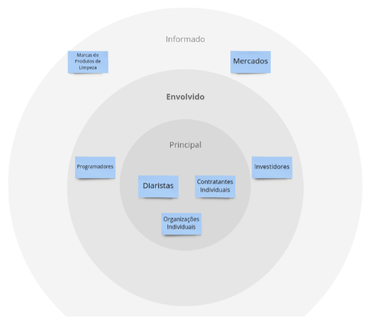
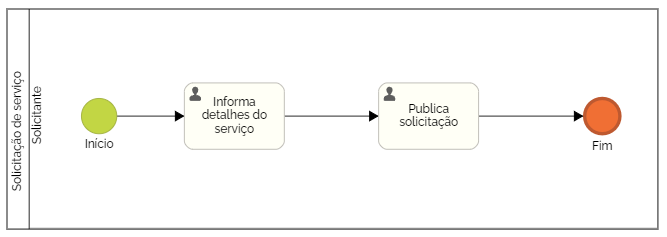
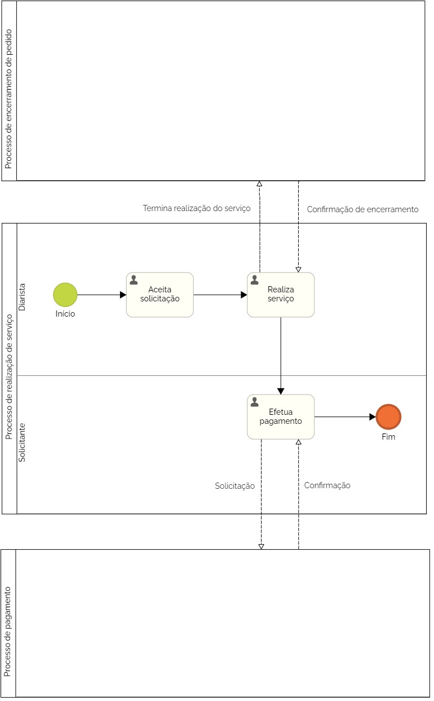
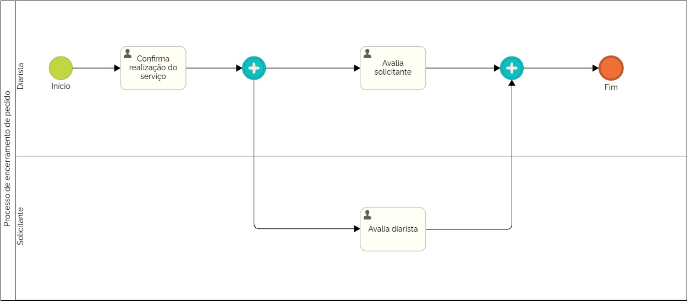
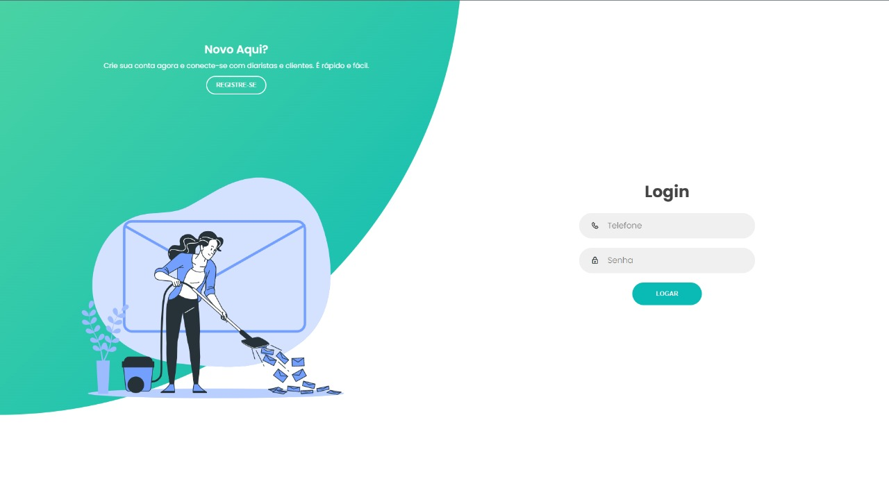
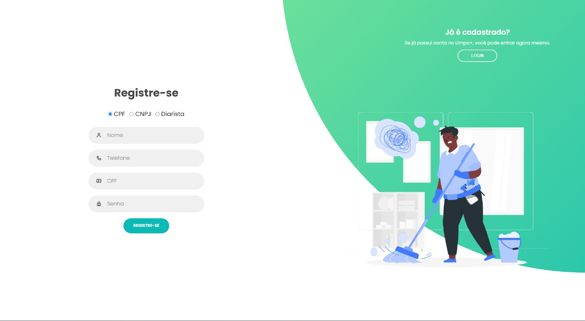
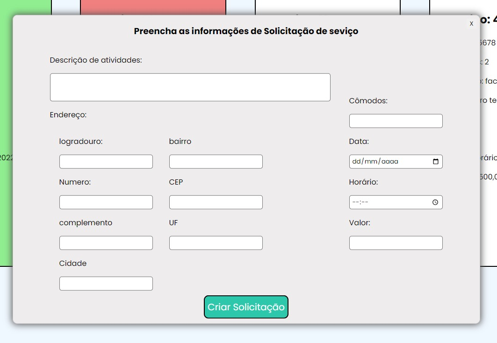
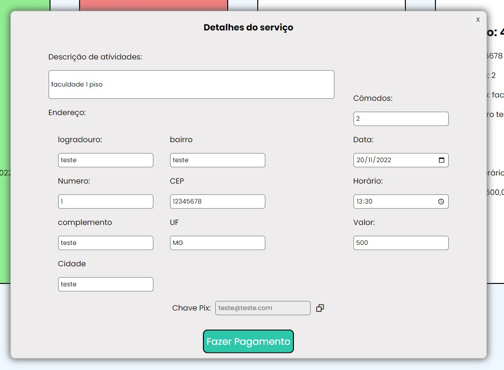

# Limpa Mais

*   Daniel Estevam Pacheco de Souza - danielestevam282@gmail.com
*   Gabriel Augusto Souza Borges - gabrielaugustosb13@gmail.com
*   Ivan Francisco de Oliveira Junior - ivan.oliveirapro@gmail.com
*   Marcus Viniccius Souza de Freitas - marcus.viniccius@hotmail.com
*   Rafael Pierre Martins - pierredoc28@gmail.com
*   Vinicius Assis Lima - thelimavinicius@gmail.com

---

Professores:

*   Hugo Bastos de Paula
*   Felipe Augusto Lima Reis
*   Cristiano Neves Rodrigues

---

_Curso de Engenharia de Software, Unidade Praça da Liberdade_

_Instituto de Informática e Ciências Exatas – Pontifícia Universidade de Minas Gerais (PUC MINAS), Belo Horizonte – MG – Brasil_

---

**Resumo**. Muitas pessoas apresentam a dificuldade de encontrar diaristas de maneira formal. Com esse intuito, nossa equipe decidiu desenvolver uma plataforma que facilite o contato entre o contratante e o contratado.

---

## 1. Introdução

   1.1 Contextualização
    
   No contexto atual vemos uma carência por aplicações voltados para os profissionais de limpeza, algo que sempre foi presente na vida de muitoas pessoas deve também ser colocada no mundo da tecnologia, assim pretendemos fazer algo que supra essa necessidade.
   A nossa proposta é criar uma plataforma onde o contratante solicita o serviço de limpeza de um empregado doméstico / empresarial . Uma Pessoa Física ou Jurídica cadastra a solicitação de serviço de limpeza na plataforma e empregados cadastrados na mesma, podem visualizar propostas na região , podendo aceitá-las ou recusá-las. A partir do momento em que o empregado aceita a proposta , ele consegue acesso ao número do contratante para alinhar a prestação do serviço.

   1.2 Problema

   Muitas pessoas que possuem a necessidade de contratar diaristas , passam dificuldades em encontra-las. Já diaristas encontram dificuldades em alcançar novos clientes , visto que, muitas vezes as diaristas são contratadas de maneira informal ou por indicação.
   Algo tão simples como a conexão entre a diarista e um contratante pode ser completamente dificultada se não houver os meios necessários, e atualmente com a indústria da tecnologia diversos problemas de logística como esse já foram resolvidos, e por isso o mercado de diaristas tem uma grande carência nesse âmbito. Uma carência de uma aplicação que supra essas necessidades.

   1.3 Objetivo geral

   O objetivo do projeto Limpa + é integrar e simplificar a conexão entre diaristas e contratantes, proporcionando uma experiência rápida e acessível para facilitar a contratação de serviços de limpeza e promover o trabalho de diaristas que desejam ter um maior alcance na sua área de atuação.

   1.3.1 Objetivos específicos
        
   
   Desenvolver uma plataforma que ajude diaristas a encontrarem trabalho.
   Ajudar pessoas e empresas a encontrar profissionais de limpeza.
   Facilitar a comunicação entre diarista e contratante.
   Criar laços de contratantes com Diaristas

   1.4 Justificativas

   O projeto se torna necessário pois, atualmente, econtra-se dificuldades na descoberta de profissionais de limpeza com rapidez e simplicidade, principalmente quando não há indicação.

## 2. Participantes do processo

Stakes Holders mais interessados no projeto seriam Diaristas, Contratantes Individuais e Organizações Contratantes. Os menos interessados são: O time de Desenvolvedores, Investidores e o Mercado de Produtos de Limpeza.

A seguir histórias de pessoas que poderiam ser beneficiadas com o sistema do Limpa Mais.

Usuário Pessoa Jurídica: Best Bikes é uma empresa de aluguel de bicicletas localizada na região da Pampulha em Belo Horizonte. Com o grande fluxo de clientes que solicitam os serviços da empresa, o local fica extremamente sujo nos dias de segunda-feira em que a empresa não abre. E como nenhum funcionário trabalha neste dia, a limpeza estava ficando a cargo do dono. Por motivos de tempo, desorganização sanitária e exaustão, a Best Bikes decidiu contratar diaristas freelancers para atuar toda segunda-feira no estabelecimento. Para isso, a Limpa Mais foi a escolhida para tal por ser uma intermediadora fácil entre contratante e contratado para esse tipo específico de situação.

Usuário Pessoa Física: O usuário Eduardo se mudou recentemente para Belo Horizonte e está precisando de um diarista para realizar a limpeza de sua casa. Ele não possui network em sua cidade nova e está sem tempo para procurar por indicações. Por isso decidiu acessar o Site Limpa Mais, que facilita e agiliza o processo de encontrar prestadores de serviços de limpeza. Utilizando os sistema de filtros e pesquisa que são oferecidos pelo site, Eduardo encontrou o diarista que se encaixa  melhor com o seu perfil e localização. Após isso, foi feito o agendamento para conclusão da limpeza e Eduardo resolveu seu problema de encontrar diaristas.

Usuário Diarista: A usuária Patrícia durante anos trabalhou como Diarista na casa de pessoas que a contratavam. Ao longo dos anos ela exerceu suas funções em diversas casas diferentes e por conta disso foi adquirindo muitos contatos, sempre uma pessoa a indicava para outras, por isso, ela sempre tinha serviço à sua disposição. Uma outra questão que lhe trazia muitas propostas era o fato dela residir em Belo Horizonte e na cidade sempre havia muita procura pelo serviço, para Patrícia nunca foi um problema ter trabalho.
Por conta da pandemia seu pai acabou falecendo e por isso ela voltou para o interior para estar junto de sua mãe, que acabou ficando sozinha e já em idade avançada precisava da companhia de alguém para seus cuidados. E por conta disso, Patrícia acabou indo para um local novo onde quase não tinha contatos para serviço e acabou ficando sem emprego por um tempo. Com o auxílio da aplicação Limpa Mais, Patrícia pode encontrar diversas pessoas precisando do seu serviço, e assim, mesmo em um local novo pode continuar trabalhando em sua área e encontrando contratantes que se adequam a sua rotina.

## 3. Modelagem do processo de negócio

### 3.1. Análise da situação atual

O serviço mais próximo e conhecido do processo que vamos oferecer é o GetNinjas, ele funciona como um site onde você encontra diversos serviços de atendimento doméstico, desde encanador a eletricista e pode solicitar o serviço desejado através do contato direto com o prestador do serviço.
Como posto, nada de fácil acesso e voltado especificamente para diaristas existe hoje no mercado. Além da questão que muitas diaristas não são grandes usuários digitais, desse modo, se torna ainda mais difícil a criação de plataformas como essa, já que não há um grande público alvo.
Então, temos quase ou nenhum produto sendo ofericido que cubra as carências citadas, além de um público que ainda precisa ser cativado a usar esses tipos de tecnologias.

## 3.2. Descrição Geral da proposta

O Limpa Mais irá trabalhar apenas com o serviço de diarista, moldado todo para esse tipo específico de serviço.
E seu funcionamento se dará através de uma requisição criada pelo solicitante, onde ele informará os detalhes do serviço solicitado. Essa requisição será enviada para os prestadores de serviço mais próximos que vão optar por aceitar ou não a  solicitação, de acordo com seu interesse mútuo nela.

A seguir uma descrição geral de cada processo.

Processo Usuário Pessoa Jurídica:
*   Usuário Pessoa Jurídica faz cadastro na plataforma (Nome da empresa, CNPJ, Telefone, E-mail, Senha), faz o login (Telefone/E-mail e senha)
*   Realiza o login (Telefone/E-mail e senha)
*   Cria a solicitação do serviço
*   Informa o endereço onde o serviço será prestado, detalhamento do serviço (tamanho do ambiente), profissionais necessários, horário, forma de pagamento
*   Finaliza a solicitação
*   Usuário aguarda um aceite, para que o serviço seja atendido pelo prestador de serviço que aceitar a solicitação
*   Usuário avalia o trabalho realizado e emite a nota fiscal para ser entregue aos prestadores.

Processo Usuário Pessoa Física:
*   Usuário Pessoa Física, faz o seu cadastro na plataforma (Nome completo, CPF, Telefone, E-mail, Senha)
*   Realiza o login (Telefone/E-mail e senha)
*   Cria a solicitação do serviço
*   Informa o endereço de onde o serviço será prestado, detalhamento do serviço(Cômodos), horário(à combinar), forma de pagamento e finaliza a solicitação
*   Aguarda um aceite, para que o serviço seja atendido pelo prestador de serviço que aceitar a solicitação
*   Ao finalizar o serviço, o usuário avalia o trabalho realizado e encerra a solicitação

Processo Usuário Diarista:
*   O Usuário Diarista, faz o seu cadastro na plataforma (Nome completo, Regiões de atendimento, CPF, Telefone, Senha)
*   Realiza o login (Telefone e senha)
*   A partir do primeiro acesso ele recebe as solicitações de serviço próximas às regiões cadastradas
*   Aceita uma solicitação de seu interesse
*   Informa o valor que será cobrado pelo serviço e aguarda o aceite do solicitante
*   Após a realização do serviço, o Diarista recebe o pagamento pela plataforma e o feedback de avaliação

## 3.3. Modelagem dos Processos

### 3.3.1 Processo 1 – Processo de Cadastro e Validação

### 3.3.2 Processo 2 – Processo de Login

### 3.3.3 Processo 3 – Processo de solicitação do Serviço

### 3.3.4 Processo 4 – Processo de realização do serviço

### 3.3.5 Processo 5 – Processo de Pagamento

### 3.3.6 Processo 6 – Processo de encerramento do serviço

## 4. Projeto da Solução

### 4.1. Detalhamento das atividades

#### Processo 1 – CADASTRO DE USUÁRIOS E VALIDAÇÃO

**Registro login do usuário**

| **Campo** | **Tipo** | **Restrições** | **Valor default** |
| --- | --- | --- | --- |
| Nome | Caixa de texto | - | - |
| Numero de telefone | Número | Apenas números | - |
| Senha | Caixa de texto | Pelo menos 6 dígitos | - |

**Selecionar tipo de usuário**

| **Campo** | **Tipo** | **Restrições** | **Valor default** |
| --- | --- | --- | --- |
| Usuário Pessoa Física | Seleção única | - | Não selecionado |
| Usuário Pessoa Jurídica | Seleção única | - | Não selecionado |
| Usuário Diarista | Seleção única | - | Não selecionado |

**Registro de Usuário diarista**

| **Campo** | **Tipo** | **Restrições** | **Valor default** |
| --- | --- | --- | --- |
| CPF | Caixa de números | Apenas números | - |
| Chave pix | Caixa de texto | Email, texto, numero, chave aleatória | - |

**Registro de Usuário Pessoa Física**

| **Campo** | **Tipo** | **Restrições** | **Valor default** |
| --- | --- | --- | --- |
| CPF | Caixa de texto | Apenas números | - |
| CEP | Caixa de texto | CEP válido | - |
| Logradouro | Caixa de texto | - | Info. retornada pela API de CEPs |
| Número | Número | Apenas números | Info. retornada pela API de CEPs |
| Bairro | Caixa de texto | - | Info. retornada pela API de CEPs |

**Registro de Usuário Pessoa Jurídica**

| **Campo** | **Tipo** | **Restrições** | **Valor default** |
| --- | --- | --- | --- |
| CNPJ | Caixa de números | Apenas textos | - |
| CEP | Caixa de texto | CEP válido | - |
| Logradouro | Caixa de texto | - | Info. retornada pela API de CEPs |
| Número | Número | Apenas números | Info. retornada pela API de CEPs |
| Bairro | Caixa de texto | - | Info. retornada pela API de CEPs |

#### Processo 2 – LOGIN

**Login**

| **Campo** | **Tipo** | **Restrições** | **Valor default** |
| --- | --- | --- | --- |
| Login | Caixa de Texto | Numero |  |
| Senha | Caixa de Texto | Mínimo de 8 caracteres |  |

#### Processos 3 e 4 – SOLICITAÇÃO E REALIZAÇÃO DE SERVIÇO

**Informa detalhes do serviço**

| **Campo** | **Tipo** | **Restrições** | **Valor default** |
| --- | --- | --- | --- |
| Descrição de atividades | Área de texto | - | - |
| Imagens do local | Imagem | Tipo de arquivo jpg, jpeg, png | - |
| CEP | Caixa de texto | CEP válido | - |
| Logradouro | Caixa de texto | - | Info. retornada pela API de CEPs |
| Número | Número | Apenas números | Info. retornada pela API de CEPs |
| Bairro | Caixa de texto | - | Info. retornada pela API de CEPs |
| Complemento | Caixa de texto | - | Info. retornada pela API de CEPs |
| Horário | Timestamp | - | - |
| Observações | Área de texto | - | - |

#### Processo 5 – PAGAMENTO

**Requisição para Pagamento**

| **Campo** | **Tipo** | **Restrições** | **Valor default** |
| --- | --- | --- | --- |
| Chave Pix | Caixa de Texto | Telefone, E-mail, CPF ou Chave Aleatória | - |
| Valor | Numero | - | - |

#### Processo 6 – ENCERRAMENTO DO SERVIÇO

**Avaliação do serviço com nota entre 0 e 5**

| **Campo** | **Tipo** | **Restrições** | **Valor default** |
| --- | --- | --- | --- |
| Avaliação do serviço | Número | Valores entre 0 e 5 | - |

### 4.2. Tecnologias

As tecnologias que serão utilizadas para resolução do problema são:

- Vscode: como editor de texto para o desenvolvimento dos códigos.
- DBeaver: para teste e edição de cógigos SQL.
- Vanilla JS: para desenvolvimento do Front-End;
- Node JS: para desenvolvimento do Back-End;
- PostGreSQL: para criação do Banco de dados;
- Vercel: para deploy do Front-End;
- Heroku - para deploy do Back-End e banco de dados;
- Git e Github: Para controle de versão e armazenamento de código;
- Whatsapp e Discord: Comunicação da equipe e compartilhamento de dados.

## 5. Modelo de dados

## 6. Indicadores de desempenho

| **Indicador** | **Objetivos** | **Descrição** | **Cálculo** | **Fonte dados** | **Perspectiva** |
| --- | --- | --- | --- | --- | --- |
| Taxa de serviços criados e atendidos | Acompanhar demanda por serviços medindo a porcentagem de atendimento | Mede % de serviços atendidos | Serviços criados/Serviços atendidos * 100 = %  | Tabela Servico e Tabela Atende_Servico| Processo interno |
| Percentual de usuários ativos | Acompanhar relação de usuários ativos na plataforma que demandam serviço | Mede % de usuários ativos  | Nº usuarios cadastrados/Nº usuarios com serviços ativos * 100 = % | Tabela Usuario e Tabela Cria_Servico | Crescimento e Utilização |
| Percentual de diaristas ativos | Acompanhar relação de diaristas ativos na plataforma que estão atendendo serviço | Mede % de diaristas ativos  | Nº diaristas cadastrados/Nº diaristas com serviços ativos * 100 = % | Tabela Diarista e Tabela Atende_Servico | Crescimento e Utilização |
| Percentual de avaliações | Levantar media de avaliações dos usuários e diaristas relacionados ao serviço | Percentual de avaliação em relação ao total das avaliações recebidas  | Total das avaliações/Nº de avaliações recebidas * 100 = %  | Tabela Avalia_Diarista e Tabela Avalia_Usuario | Feedback de atuação dos usuários |
| Validação pagamento | Garantir que os pagamentos estão sendo feitos corretamente | Validar se o pagamento foi feito na plataforma |   | Tabela Pagamento | Clientes |

## 7.Sistema desenvolvido

O Limpa Mais, desenvolvido para facilitar o encontro de diaristas e de novas oportunidades de trabalho, funciona da seguinte forma:

A tela inicial, contem a opção de login através dos campos 'Telefone' e 'Senha' para acesso do usuário, caso seja seu primeiro acesso, ele consegue se cadastrar na plataforma através do botão 'REGISTRE-SE' : 

Na tela de registro, basta o usuário escolher entre as opções:
- CPF: Para se cadastrar com o perfil de pessoa física contratante;
- CNPJ: Para se cadastrar com o perfil de pessoa jurídica contratante;
- Diarista: Para se cadastrar com o perfil de prestador de serviços.
 
 Após isso, basta preencher os campos solicitados.

- USUÁRIO PF/PJ

Acessando a plataforma com um perfil de usuário contratante, você terá acesso ao histórico de serviços criados, os detalhes desses serviços e a classificação de cada um, informando se o serviço está pendente, em processo ou concluído.

O botão '+' te da a opção de criar uma nova solicitação de serviço e o btão 'SAIR' encerra seu acesso ao sistema.

Ao acessar o botão '+' para criar uma nova solicitação de serviço, o usuário precisa preencher os campos solicitados. Caso os campos sejam validados, basta o usuário finalizar o processo com o botão 'Criar Solicitação'. Assim, a solicitação de serviço é gerada e enviada para os prestadores de serviço.

Após o serviço ser atendido, o usuário tem acesso a chave pix do diarista para realizar o pagamento pela sua instituição financeira. Com o pagamento realizado ele pode clicar em 'Fazer Pagamento', essa ação encerra a solicitação de serviço criada por ele, caso o usuário Diarista associado ao serviço confirme o pagamento.

- USUÁRIO DIARISTA
 
Acessando a plataforma com um perfil de usuário Diarista, Você terá acesso ao histórico de solicitações de serviço, os detalhes desses serviços e a classificação de cada um, informando se a solicitação está pendente, em processo, concluída ou aguardando pagamento.

Para aceitar uma nova solicitação de serviço o usuário diarista precisa escolher o card do serviço e ao abrir ele e concordar com as informações inseridas, utilizar o botão 'Pegar Serviço'. 
Nessa mesma tela, após a realização do serviço, a Diarista possui as opções de 'Cobrar pagamento' ao usuário Contratante e 'Confirmar pagamento' para concluir aquele serviço.

## 8. Conclusão

Esse sistema pretende auxiliar o contrato de Diaristas, diminuindo a dificuldade que as pessoas possuem em se conectar com esses prestadores de serviço e encerrando a dependencia por indicações. E assim, os diaristas encontrem novas oportunidades para demonstrar o seu trabalho e aumentem sua cartela de clientes, beneficiando assim sua renda financeira. 

Após a definição do problema e jutificativa do mesmo, foram discutidas formas para a implementação da solução entre os membros da equipe do projeto com orientação dos professores designados. Nessas definições, foram observadas por exemplo a necessidade do usuário possuir um numero de telefone para acesso e comunicação, a chave pix para evitar o pagamento manual e diminuir os possíveis transtornos que possam vir a existir nesse processo. Necessário no futuro, avaliar e estudar a possibilidade de integrar uma API de validação de pagamento, juntamente ao aplicativo de instituição financeira que ele será realizado, para que o processo se encerre de forma automática. Com isso, conclui-se assim a entrega da primeira versão do sistema para apresentação final e utilização de terceiros.

# APÊNDICES

[Código](https://github.com/ICEI-PUC-Minas-PPLES-TI/plf-es-2022-2-ti2-0924100-limpa/tree/master/src)

[Link para à apresentação do projeto Limpa +](https://youtu.be/JWlA3TuxpZo)

[Limpa+ - Projeto hospedado na Vercel](https://limpamais.vercel.app/)

